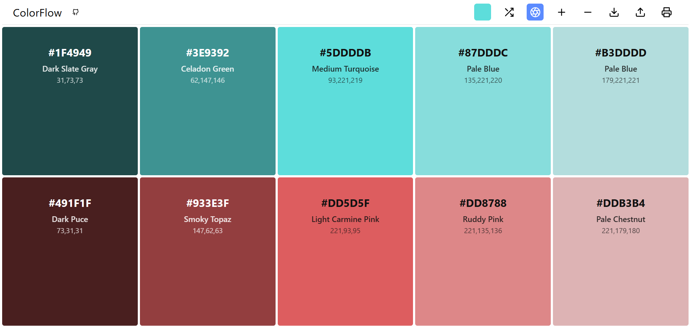

# ColorFlow



ColorFlow is a web-based color palette generator that allows you to create, explore, and export beautiful monochromatic and complementary color palettes. Designed for designers, developers, and anyone who works with color, ColorFlow provides a fast and intuitive interface for generating and managing color schemes.

## Features

- 🎨 **Palette Generation**: Instantly generate monochromatic or complementary color palettes based on a base color you have chosen with the  **Color Picker**: Select your base color using a modern color picker. It instantly create a palette based on it.

- 🔄 **Random Palette**: Generate a random palette with a single click on **shuffle** or by pressing the spacebar.

- ➕➖ **Adjust Colors**: Add or remove colors in your palette (minimum 3 colors).

- 🔁 **Switch Modes**: Toggle between monochromatic and complementary palette modes.

- 💾 **Export**: Download your palette as JSON, CSV, or PDF. (PNG and various palette fileformats soon)

- 📂 **Import**: Load a palette from a JSON file. (Latest generated palette directly loaded on app's opening in the next update)

- 🖨️ **Print**: Print your palette directly from the browser.

- 🏷️ **Color Names**: Each color is matched to its closest named color from a large dataset.

- 🖥️ **Responsive UI**: Clean, modern, and responsive interface.


### Online Demo

Try it live: [ColorFlow GitHub Pages](https://manerr.github.io/colorflow)

### Local Setup

1. **Clone the repository:**
   ```bash
   git clone https://github.com/Manerr/Colorflow.git
   cd Colorflow
   ```
2. **Open `index.html` in your browser.**
   - No build step required. All logic is client-side JavaScript.


## Export Formats

- **JSON**: Exports an array of color objects with name, hex, RGB, and HSV values.
- **CSV**: Exports a table of color names and values.
- **PDF/Print**: Uses the browser's print dialog for a printable palette.

## Importing Palettes

- Click the upload button and select a JSON file exported from ColorFlow.
- The palette will be loaded and displayed.

## Data & Credits

- Color names and values are sourced from a large dataset in `data/colors.js`.
- Developed by [Paul T_(Manerr)](https://github.com/Manerr).
- Source code: [https://github.com/Manerr/Colorflow](https://github.com/Manerr/Colorflow)

## License

This project is licensed under the MIT License.

---

*ColorFlow - a monochrome and complementary palette generator.* 